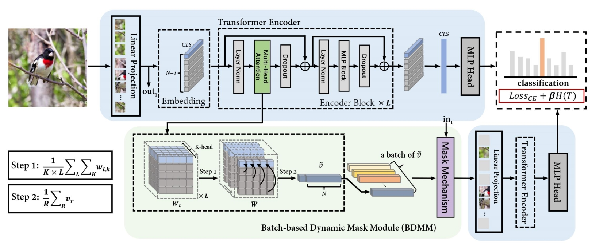

# R^2-Trans

This is a project website of the paper 
"[R^2-Trans: Fine-Grained Visual Categorization with Redundancy Reduction](https://arxiv.org/abs/2204.10095)" 
This website includes the following materials for testing and checking our results reported in our paper 

1. The trained model
2. The test scripts
3. More visualization of our experiments [TODO]




## Usage

### 1. Prepare the environment

We trained and tested our code in the following environments with one A6000 GPU:  
ubuntu18.04   
python3.7  
CUDA 11.1  
cuDNN 8.0.5  
Pytorch 1.8.1  
...

Then install the required packages:

``` bash

pip install -r requirements.txt

```

### 2. Preparing Dataset and Model
We provide trained models ([Dropbox](https://www.dropbox.com/sh/vhl6yns2vbgy2we/AAAWnn4P43C7c1PEpKIrp2MBa?dl=0)) 
on three different datasets: cub, dogs and nabirds.
You can download model files as well as corresponding datasets, and organize them as follows:

```
.
├── checkpoint
│   ├── cub_R2-Trans_checkpoint.pth
│   ├── dogs_R2-Trans_checkpoint.pth
│   └── nabirds_R2-Trans_checkpoint.pth
├── data
│   ├── cub/
│   ├── dogs/
│   └── nabirds/
└── ···
```


### 3. Running

example for cub:
```bash

python3 test.py --dataset cub 
                --data_root ./data/CUB_dataset/CUB_200_2011/ 
                --checkpoint ./checkpoint/cub_R2-Trans_checkpoint.pth
                --eval_batch_size 5
                --gpu_ids 0

```


